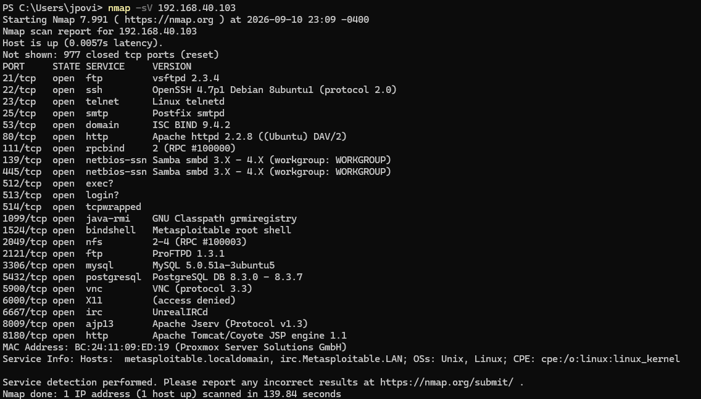

Home SOC Lab: Security Onion + Metasploitable2

A hands-on lab built on a Dell PowerEdge R410 running Proxmox VE, focused on standing up a working network detection sensor and validating it against real, generated traffic.

Environment
Hypervisor: Proxmox VE, Dell PowerEdge R410 (24 cores, 63GB RAM)
Sensor: Security Onion 3.2.0 (Standalone install) — 6 cores, 24GB RAM, 250GB disk
Target: Metasploitable2 (intentionally vulnerable Ubuntu VM) — 1 core, 1GB RAM
Network: All VMs on a shared Proxmox bridge (vmbr0), same subnet as the rest of the home network
What I Built
Installed Security Onion as a Standalone sensor with a dedicated management interface and a second NIC intended for traffic monitoring.
Imported Metasploitable2 as a target machine to generate real, detectable traffic against.
Ran Nmap scans (-sV, and later -sS -T4 -p-) from an external laptop against Metasploitable2 to simulate reconnaissance activity.
Verified the full detection pipeline end-to-end: packet capture → Zeek/Suricata processing → Elasticsearch indexing → alerts visible in the Security Onion web console.

